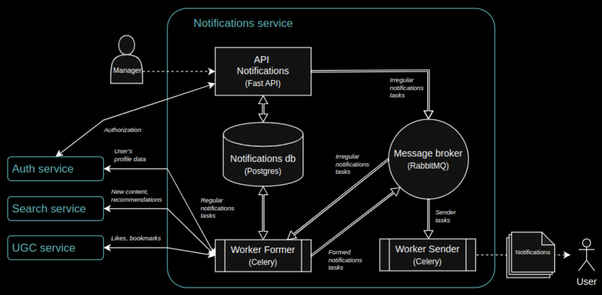

# Сервис нотификации

## Схема сервиса

### Основные команды для запуска сервисов:

- **запуск сервисов в docker compose**: 
`make up`;
- **остановка сервисов**: 
`make destroy`;
- **тесты notifications-api**:
`make tests-ntf`.

Более подробно все основные команды представлены в [Makefile](Makefile).